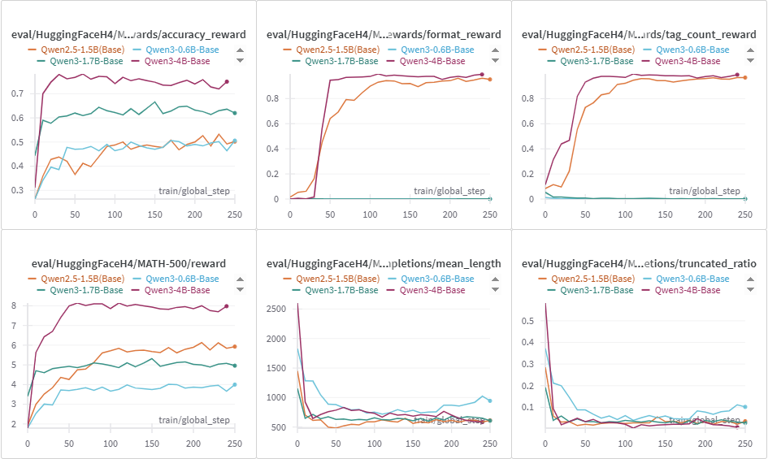
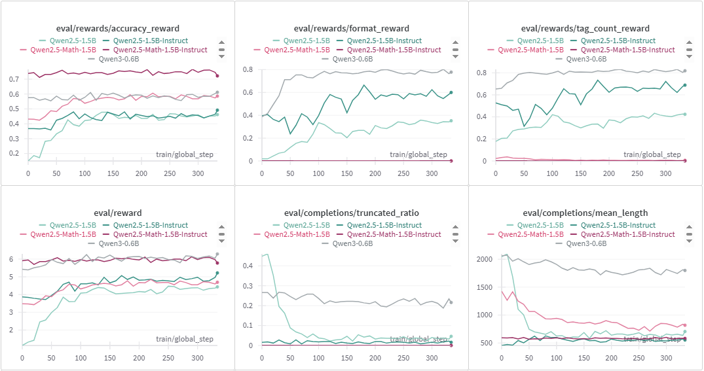
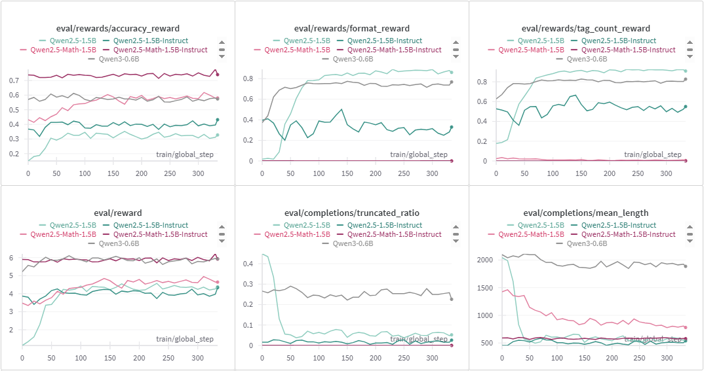

<h1 align="center"> simpleR1: A simple framework for training R1-like reasoning models</h1>


**simpleR1** is a simple framework for training R1-like reasoning models, aiming to improve llm's reasoning abilities. 
This repository builds upon Hugging Face's TRL GRPO Trainer and the [open-r1](https://github.com/huggingface/open-r1) project, with a focus on ease of use and enhanced training features. 


## Key Features

The latest version includes an upgraded GRPO Trainer with a custom evaluate function for simultaneous training and evaluation, modularized model completion and reward score estimation.

- Enhanced GRPO trainer with multi-iteration support, more precise time estimation (tqdm), custom evaluate block, and wandb logging.

- Modularized generate, score, and log for completions, enabling more user-defined controls.

- Implementation of a simple reject sampling and dynamic sampling approach for generation.

- Evaluation on multiple benchmarks with/without training the model.


## Updates

- **version 0.3.0**:
  - Add a simple dynamic sampling approach for generation:
    - Filter easy training samples.
    - Resample hard training samples.
  - Support multiple datasets for training and evaluation.


## 📁 Repository Structure


```
├── configs/
│   ├── accelerate_configs/    # Deepspeed configs
│   │   ├── ddp.yamal          # Distributed Data Parallel (DDP) config
│   │   ├── zero1.yamal        # Deepspeed zero1 config
│   │   └── ...                
│   └── grpo_template.yaml     # Template for specifying arguments
│       └── ...     
│           
├── scripts/                   # Bash scripts to run
│   ├── train_grpo_1.5b-single.sh # Train a 1.5b model with a single gpu
│   ├── train_grpo_4b-single.sh   # Train a 4b model with a single gpu
│   │
│   ├── run_vllm_serve_3b.sh   # Run a vllm server for a 3b model
│   ├── train_grpo_3b.sh       # Train a 3b model
│   │
│   ├── run_vllm_serve_4b.sh   # Run a vllm server for 4b model
│   ├── train_grpo_4b.sh       # Train a 4b model
│   ├── train_grpo_4b-zero1.sh # Train a 4b model with deepspeed zero1
│   │
│   ├── eval_grpo_4b.sh        # Evaluate a 4b model without training it
│   └── ...         
│           
├── src/                       # Python codes
│   ├── arguments.py           # Model, scripts, and training arguments
│   ├── vllm_serve.py          # vllm server (called by `run_vllm_serve*.sh`)
│   ├── vllm_client.py         # vllm client (called by `grpo_trainer.py`)
│   ├── rewards.py             # Reward functions
│   ├── grpo_trainer.py        # Trainer for GRPO [core part]
│   ├── run_grpo.py            # Python scripts to run GRPO
│   └── utils.py               # Supporting utils
│
├── requirements.txt           # Full list of requirements
├── LICENSE
└── README.md                  # This document
```


## 📚 Examples


We trained `Qwen/Qwen2.5-1.5B` (base model), `Qwen/Qwen3-0.6B-Base`, `Qwen/Qwen3-1.7B-Base`,`Qwen/Qwen3-4B-Base` models on [MATH-benchmark](https://huggingface.co/datasets/nlile/hendrycks-MATH-benchmark), with real-time evaluation on [MATH-500](https://huggingface.co/datasets/HuggingFaceH4/MATH-500) using the `evaluate` function.

Below is the wandb log on the evaluation dataset:
> In the log below, we simply set `num_eval_generations=1` (one completion for each problem in the eval dataset), and `num_eval_generations=k` would yield `average@k`/`avg@k` metrics.
For other metrics, such as `pass@k`, please consider to change the logic in the `evaluate` function.

<p align="center">
  
  <br>
  📈
  <strong>Fig 1. SimpleR1 running example (eval on MATH-500).</strong>
  <br>
</p>


<details>
  <summary>Click to expand/collapse more training examples</summary>

### Training on MATH-benchmark and evaluating on MATH-500

We trained four `Qwen2.5-1.5B*` models and one `Qwen3-0.6B*` model on [MATH-benchmark](https://huggingface.co/datasets/nlile/hendrycks-MATH-benchmark), with real-time evaluation on [MATH-500](https://huggingface.co/datasets/HuggingFaceH4/MATH-500) using the `evaluate` function.

- **Models**: 
`Qwen/Qwen2.5-1.5B`, `Qwen/Qwen2.5-1.5B-Instruct`, `Qwen/Qwen2.5-Math-1.5B`, `Qwen/Qwen2.5-Math-1.5B-Instruct`, `Qwen/Qwen3-0.6B`.

- **Setup**: Trained for 1 epoch, 3 grpo iterations, with one NVIDIA A100-80G GPU and parameters as shown in the usage example. The max completion length is set as 2,048 and 4,096 for train and eval mode, respectively. Train and evaluation accuracy and completion length were logged via wandb.
  > Note: The example parameter setting is for demonstration purposes only, not optimal. For example, increasing the learning rate to 5e-6 or disabling the kl penalty can further improve the performance.

- **Rewards**: Rule-based rewards were adopted in the example, including 'accuracy reward', 'format reward', and 'tag count reward', with different weights to arrive at the final reward signal. For example, `reward = 8 * accuracy_reward + 1 * format_reward + 1 * tag_count_reward`.

- **Results**: 
  - All models improved accuracy, with Math-specific models (`Qwen2.5-Math-1.5B*`) outperforming general models (`Qwen2.5-1.5B*`). 
  - Completion length varied, with Instruct models often producing shorter outputs. 
  - `Qwen3-0.6B` outperforms all the tested `Qwen2.5*-1.5B*` variants except for `Qwen2.5-Math-1.5B-Instruct`, but this superior performance comes at the expense of generating significantly more tokens. 

### Model Accuracy Comparison

Below is the plot comparing evaluation accuracy across the four models:

<p align="center">
  
  <br>
  <strong>Fig 2. SimpleR1 running example (eval on MATH-500).</strong>
  <br>
  📈 More train and eval logs are available at WandB project: 
      <a href="https://api.wandb.ai/links/yflyzhang/wkdme9ea">wandb log</a>.
</p>


### Results Table


| Model | Initial Accuracy | Best Accuracy | Completion Length Trend | Token Efficiency | Runtime |
| --- | --- | --- | --- | --- | --- |
| `Qwen2.5-1.5B` | 0.150 | 0.478 | 2,044 → 550 tokens | ↑ | 3h 37m 55 |
| `Qwen2.5-1.5B-Instruct` | 0.368 | 0.492 | 455 → 552 tokens |  ↓ | 2h 18m 43 |
| `Qwen2.5-Math-1.5B` | 0.432 | 0.606 |  1425 → 812 tokens | ↑ | 3h 6m 20s |
| `Qwen2.5-Math-1.5B-Instruct` | 0.738 | 0.766 | 591 → 581 tokens | -- | 5h 39m 41 |
| `Qwen3-0.6B` | 0.576 | 0.612 | 2096 → 1799 tokens | ↑ | 11h 3m 10 |


### Training on gsm8k and evaluating on MATH-500

We also trained the models on [gsm8k](https://huggingface.co/datasets/openai/gsm8k) (with 1000 samples for fast test) and evaluated on [MATH-500](https://huggingface.co/datasets/HuggingFaceH4/MATH-500). The evaluation results can be found as follows:

<p align="center">

<br>
<strong>Fig 3. Train on gsm8k and evaluate on MATH-500.</strong>
<br>
📈 More train and eval logs are available at WandB project: 
<a href="https://wandb.ai/yflyzhang/simpleR1-gsm8k/reports/SimpleR1-Training-Examples-gsm8k---VmlldzoxMjg1MjE4Mw?accessToken=ifm2s40kzp8a5i5n94jozsli50mdp978s9hz8ukjrqezo0frsj684l2aayvn5r7d">wandb log</a>
</p>


### Case Examples


Below is an response example from trained `Qwen2.5-1.5B` on a MATH-500 problem:
<details>
  <summary>Click to expand/collapse</summary>

  - **Question**:
  "Paul and Jesse each choose a number at random from the first six primes. What is the probability that the sum of the numbers they choose is even?"
  
  - **Reference Answer**: "The only way for the sum of the numbers Paul and Jesse choose to be odd is if one of them chooses 2 and the other chooses an odd prime. There are five ways for Paul to choose 2 and Jesse to choose an odd prime, and there are five ways for Jesse to choose 2 and Paul to choose an odd prime. Since there are $6\cdot 6=36$ total possible ways for Paul and Jesse to choose their numbers, the probability that the sum of the numbers Paul and Jesse choose is NOT even is $\frac{10}{36}=\frac{5}{18}$. Therefore, the probability that the sum of the numbers Paul and Jesse choose IS even is $1-\frac{5}{18}=\boxed{\frac{13}{18}}$."

  - **After Training**: "\<think>
    To determine the probability that the sum of the numbers chosen by Paul and Jesse is even, we need to consider the properties of even and odd numbers. The sum of two numbers is even if and only if both numbers are either even or both are odd.

    First, let's identify the first six prime numbers: 2, 3, 5, 7, 11, and 13.

    Next, we count the number of even and odd primes:
    - Even primes: 2
    - Odd primes: 3, 5, 7, 11, 13 (total of 5 odd primes)

    Now, let's calculate the total number of possible outcomes when both Paul and Jesse choose a number:
    - There are 6 choices for Paul.
    - There are 6 choices for Jesse.
    - Therefore, the total number of possible outcomes is $6 \times 6 = 36$.

    Next, we calculate the number of favorable outcomes where the sum is even:
    - Both Paul and Jesse choose an even prime: $1 \times 1 = 1$ (since Paul must choose 2 and Jesse must choose one of 3, 5, 7, 11, 13).
    - Both Paul and Jesse choose an odd prime: $5 \times 5 = 25$ (since Paul can choose any of the 5 odd primes and Jesse can choose any of the 5 odd primes).

    So, the total number of favorable outcomes is $1 + 25 = 26$.

    Finally, the probability that the sum of the numbers chosen is even is the ratio of the number of favorable outcomes to the total number of possible outcomes:
    $\text{Probability} = \frac{26}{36} = \frac{13}{18}$

    Therefore, the probability that the sum of the numbers they choose is even is $\frac{13}{18}$.\
    \</think>\
    \<answer>
    $\frac{13}{18}$
    \</answer>"

</details>

</details>


## 🚀 Usage

#### Clone the repository:
```bash
git clone https://github.com/yflyzhang/simpleR1.git
cd simpleR1
```


### Example training command:

  > [!NOTE] 
  > When training a model with DeepSpeed ZeRO-1/ZeRO-2 instead of DDP, please appropriately change the parameters therein.<br>
  > For example, reduce the learning rate (`learning_rate=1e-6`), use warmup (`lr_scheduler_type=cosine_with_min_lr`), and decrease the max gradient norm (`max_grad_norm=0.5`) to make the training process more stable.


1. For single-device training:

    > Make sure `vllm_mode = colocate`.
    ```bash
    bash scripts/train_grpo_1.5b-single.sh
    ```
    

    > Or override additional parameters via command line. 
    > For example,
    > ```bash
    > # export HF_HOME=/xxx/xxx/.cache/huggingface
    > export CUDA_VISIBLE_DEVICES=0
    > accelerate launch \
    >     --main_process_port $MASTER_PORT \
    >     --config_file configs/accelerate_configs/ddp.yaml \
    >     --num_processes=1 \
    > src/run_grpo.py \
    >     --do_train True \
    >     --config configs/grpo_config.yaml \
    >     --output_dir $OUTPUT_DIR \
    >     --check_gpu_idle True \
    >     --model_name_or_path Qwen/Qwen2.5-1.5B \
    >     --train_dataset_name nlile/hendrycks-MATH-benchmark \
    >     --eval_dataset_name HuggingFaceH4/MATH-500 \
    >     --use_vllm True \
    >     --vllm_mode colocate \
    >     --vllm_gpu_memory_utilization 0.2 \
    >     --num_train_epochs 1 \
    >     --num_generations 7 \
    >     --num_eval_generations 1 \
    >     --per_device_train_batch_size 7 \
    >     --per_device_eval_batch_size 64 \
    >     --dynamic_sampling True \
    >     --max_resample_attempts 3 \
    >     --gradient_accumulation_steps 1 \
    >     --num_iterations 3 \
    >     --torch_empty_cache_steps 1 \
    >     --num_train_samples_per_dataset 2000 \
    >     --num_test_samples_per_dataset -1 \
    >     --max_completion_length 2048 \
    >     --max_eval_completion_length 4096 \
    >     --reward_funcs accuracy format tag \
    >     --reward_weights 8 1 1 \
    >     --loss_type bnpo \
    >     --scale_rewards False \
    >     --mask_truncated_completions True \
    >     --epsilon 0.2 \
    >     --epsilon_high 0.3 \
    >     --temperature 1.0 \
    >     --top_p 0.95 \
    >     --eval_temperature 0.7 \
    >     --eval_top_p 0.95 \
    >     --beta 1e-5 \
    >     --repetition_penalty 1.02 \
    >     --lr_scheduler_type constant \
    >     --learning_rate 3e-6 \
    >     --save_strategy steps \
    >     --save_steps 100 \
    >     --eval_strategy steps \
    >     --eval_steps 10 \
    >     --eval_on_start True \
    >     --log_level info \
    >     --wandb_project simpleR1-train \
    >     --run_name $model_name_or_path \
    >     2>&1 | tee train.log
    >  ```


2. For multi-device training:

    Step 1: Start the vllm server for generating samples
    ```bash
    bash scripts/run_vllm_serve_4b.sh
    ```

    > Or override additional parameters via command line. For example,
    > ```bash
    > # export HF_HOME=/xxx/xxx/.cache/huggingface
    > export CUDA_VISIBLE_DEVICES=2,3
    > python src/vllm_serve.py \
    >     --model Qwen/Qwen3-4B-Base \
    >     --gpu_memory_utilization 0.9 \
    >     --tensor_parallel_size 2 \
    >     --data_parallel_size 1 \
    >     --host 0.0.0.0 \
    >     --port 8000
    >  ```
    
    
    Step 2: Start the training pipeline while interacting with the vllm server

    > Make sure `vllm_mode = server`, which is recommended against `vllm_mode = colocate` mode.

    ```bash
    bash scripts/train_grpo_4b.sh
    ```
    or train with deepspeed zero1:
    ```bash
    bash scripts/train_grpo_4b-zero1.sh
    ```

    > Or override additional parameters via command line. For example,
    > > Make sure the setting of `vllm_server_port` is consistent with the vllm_serve port in Step 1.
    > ```bash
    > # export HF_HOME=/xxx/xxx/.cache/huggingface
    > export CUDA_VISIBLE_DEVICES=0,1
    > accelerate launch \
    >     --main_process_port $MASTER_PORT \
    >     --config_file configs/accelerate_configs/zero1.yaml \
    >     --num_processes=2 \
    > src/run_grpo.py \
    >     --do_train True \
    >     --config configs/grpo_config.yaml \
    >     --output_dir $OUTPUT_DIR \
    >     --model_name_or_path Qwen/Qwen3-4B-Base \
    >     --train_dataset_name $train_dataset \
    >     --eval_dataset_name $eval_dataset \
    >     --num_train_epochs 1 \
    >     --num_generations 10 \
    >     --num_eval_generations 1 \
    >     --per_device_train_batch_size 5 \
    >     --per_device_eval_batch_size 64 \
    >     --max_resample_attempts 3 \
    >     --gradient_accumulation_steps 1 \
    >     --num_iterations 1 \
    >     --max_grad_norm 0.5 \
    >     --torch_empty_cache_steps 1 \
    >     --num_train_samples_per_dataset 2000 \
    >     --num_test_samples_per_dataset -1 \
    >     --max_completion_length 3072 \
    >     --max_eval_completion_length 4096 \
    >     --use_vllm True \
    >     --vllm_gpu_memory_utilization 0.25 \
    >     --vllm_mode server \
    >     --vllm_server_host 0.0.0.0 \
    >     --vllm_server_port 8000 \
    >     --reward_funcs accuracy format tag \
    >     --reward_weights 8 1 1 \
    >     --loss_type bnpo \
    >     --scale_rewards False \
    >     --mask_truncated_completions True \
    >     --epsilon 0.2 \
    >     --epsilon_high 0.3 \
    >     --temperature 1.0 \
    >     --top_p 0.95 \
    >     --eval_temperature 0.7 \
    >     --eval_top_p 0.95 \
    >     --beta 1e-6 \
    >     --compute_kl True \
    >     --lr_scheduler_type cosine_with_min_lr \
    >     --learning_rate 1e-6 \
    >     --save_strategy steps \
    >     --save_steps 100 \
    >     --eval_strategy steps \
    >     --eval_steps 10 \
    >     --eval_on_start True \
    >     --log_level info \
    >     --wandb_project simpleR1-train \
    >     --run_name $run_name \
    >     2>&1 | tee train.log
    > ```
  

  > [!NOTE]
  > `run_vllm_serve_4b.sh` and `train_grpo_4b.sh` provides a concrete runing example using 3 A100-80G GPUs, please change the parameters therein accordingly.


### Example evaluate command:

We can simply reuse the code to evaluate without training the model.

Note: **simpleR1** supports training and evaluating on multiple datasets.


  ```bash
  bash scripts/eval_grpo_4b.sh
  ```

  > Or override additional parameters via command line. For example,
  > ```bash
  > # export HF_HOME=/xxx/xxx/.cache/huggingface
  > export CUDA_VISIBLE_DEVICES=0,1
  > accelerate launch \
  >   --main_process_port $MASTER_PORT \
  >   --config_file configs/accelerate_configs/ddp.yaml \
  >   --num_processes=2 \
  > src/run_grpo.py \
  >   --do_eval True \
  >   --config configs/grpo_config.yaml \
  >   --output_dir $OUTPUT_DIR \
  >   --check_gpu_idle False \
  >   --model_name_or_path $model_name_or_path \
  >   --eval_dataset_name HuggingFaceH4/MATH-500 openai/gsm8k opencompass/AIME2025 \
  >   --num_eval_generations 16 \
  >   --per_device_eval_batch_size 128 \
  >   --max_eval_completion_length 4096 \
  >   --use_vllm True \
  >   --vllm_mode colocate \
  >   --vllm_gpu_memory_utilization 0.8 \
  >   --reward_funcs accuracy format tag \
  >   --reward_weights 8 1 1 \
  >   --mask_truncated_completions True \
  >   --eval_temperature 0.7 \
  >   --eval_top_p 0.95 \
  >   --log_level info \
  >   --wandb_project simpleR1-eval \
  >   --run_name $run_name \
  >   2>&1 | tee eval.log
  >  ```


## Dependencies
See `requirements.txt` for a full list, but generally you don't need to install all of them. <br>
Key dependencies include and can be installed as follows:

```bash
# 1. Create and activate a new env named/prefixed with `simpler1`
conda create --name simpler1 python==3.10
# conda create --prefix simpler1 python==3.10
# Activate the env, for example:
conda activate simpler1
# conda activate /path/simpler1

# 2. Install the key dependencies
# CUDA 12.4
pip install torch==2.6.0 torchvision==0.21.0 torchaudio==2.6.0 --index-url https://download.pytorch.org/whl/cu124

pip install transformers==4.52.4 accelerate==1.7.0 trl==0.18.2 deepspeed==0.16.9
pip install flash-attn==2.7.4.post1
pip install vllm==0.8.5.post1
pip install math-verify==0.8.0 latex2sympy2_extended==1.10.2
pip install wandb==0.20.1
```


## Issues
- Extracting and comparing the answers are not easy. <br>
  For example, when the ground truth is `\boxed{\pi}` and the model outputs `pi` or `π`, the accuracy should be 1, but the current implementation (mainly due to `math-verify`) didn't consider them as equal.
- In general, the aggregate reward is the weighted sum of each specific rewards. But when some constraints are applied, for example `mask_truncated_completions` is enabled, the aggregate reward may be smaller than the sum of each rewards as some of the rewards may be omitted.

## TODOs
- LoRA is not supported yet.
- The current implementation of resample is not that efficient.

## Contributing

Contributions are welcome! Feel free to open issues, suggest improvements, or submit pull requests.


## Acknowledgements

Special thanks to the [Open-R1 project](https://github.com/huggingface/open-r1) by Hugging Face and the broader open-source AI community for their foundational work.

## Citation

If you find this project is useful for your work, please consider to leave a star ⭐ for this repo and cite it as follows:


```
@misc{zhang2025simpler1,
      title={{simpleR1: A simple framework for training R1-like reasoning models}}, 
      author={{Yafei Zhang}},
      year={2025},
      url={https://github.com/yflyzhang/simpleR1}, 
}
```

